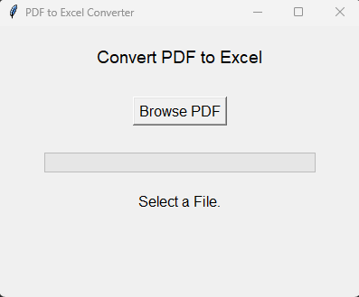
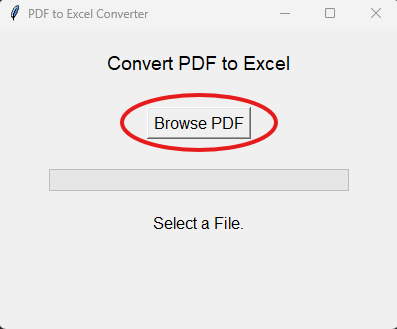
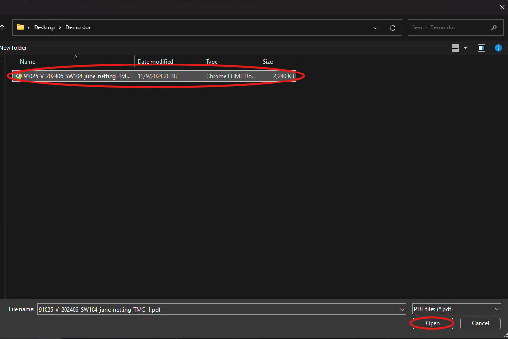
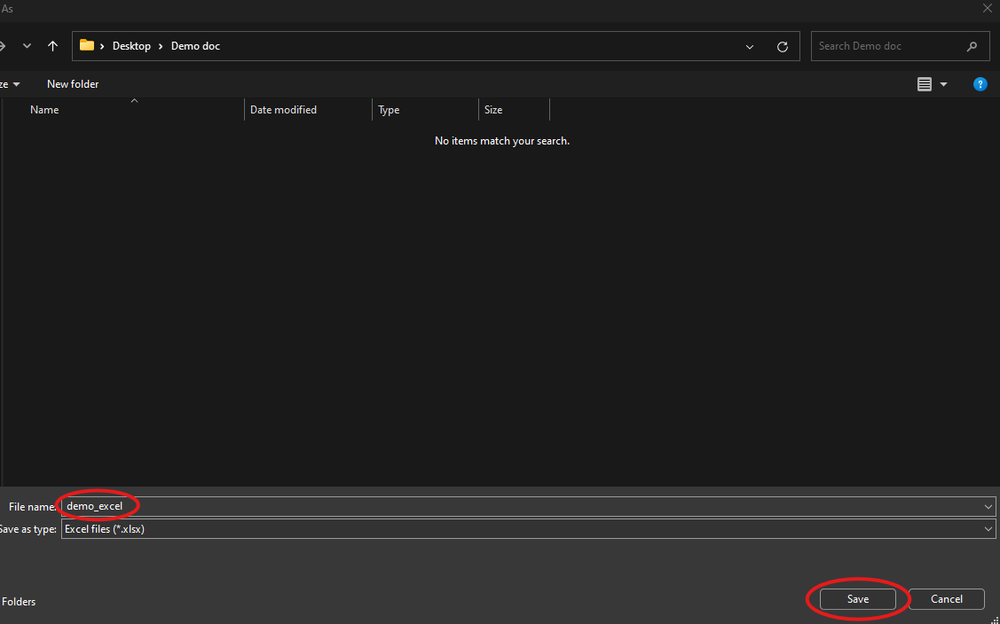
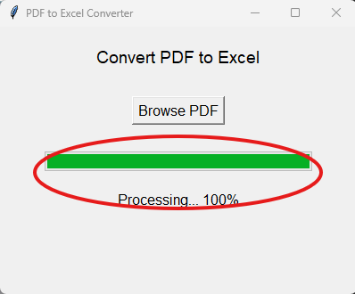
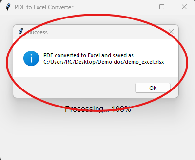

# TCI-TMC Financial Claims - PDF to Excel Converter

## Overview
This Python-based desktop application converts tabular data from PDFs into Excel files using the `tabula-py` library. The program offers a simple and Intuitive GUI built with Tkinter, enabling users to select PDF files and save the output as Excel.

## How to Use

1. **Launch the Application**: Run the main.py file to open the interface.
   

2. **Browse for a PDF File**: Click the "Browse PDF" button to select a PDF file from your computer.
   
   

3. **Select Save Location**: Choose a location to save and name the Excel output file.
   

4. **View Progress**: A progress bar will show you the percentage of the conversion process. Note that it is normal to see the application not responding if the PDF file is huge. Do not close the application if that happens. Just let it run for a few minutes. The conversion process will be done eventually. 
   

5. **Success**: Once the conversion is complete, a message will notify you that the file has been saved.
   

## Requirements
- Python 3.8+
- Java 8+ (for `tabula-py`)
- Other python dependencies are listing in the requirements.txt file

## Additional Build Instructions
If you want to run this application on any device without python and python dependencies installed. You can run the following command in the terminal to create a standalone .exe file, this allows users without any python knowledge to use the application: pyinstaller --onefile --windowed --add-data "/tabula-1.0.5-jar-with-dependencies.jar;tabula" --name pdf_to_excel_converter main.py